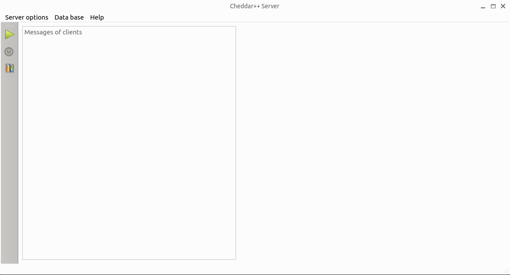
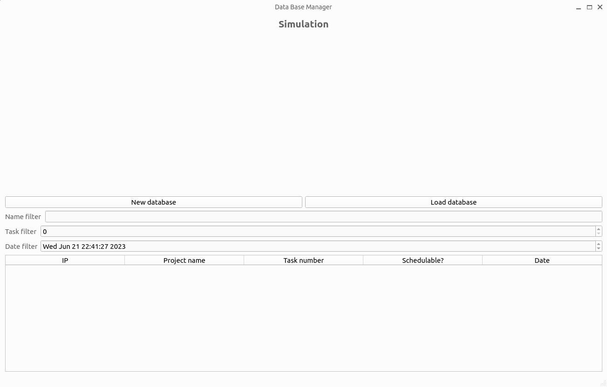
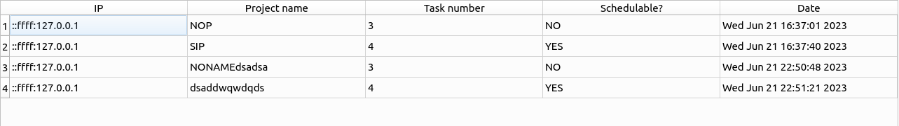
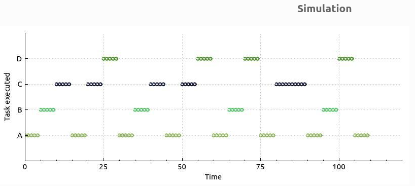
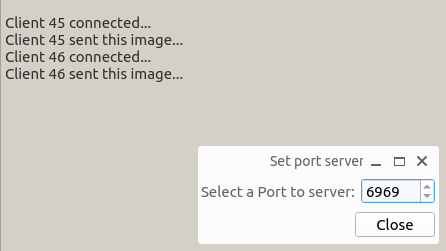

# Server Program - SOA Final Project: Real-Time Scheduler Simulator, Cheddar++
Made by:
- Ángel Javier Díaz Balboa (alu0101432632@ull.edu.es)
- Cristopher Manuel Afonso Mora (alu0101402031@ull.edu.es)
- Cheuk Kelly Ng Pante (alu0101364544@ull.edu.es)

# Description
In this project we have programmaed a real-time scheduler simulator inspired by Cheddar. We have used QT Creator framework (version 6.5.1) to make this project. This program acts as a server, all the clients will connect (via TCP) to introduce data to the database and this will send the clients images and some data of the scheduling planning. 

# Usage
When we first open **Cheddar++ Server** there are no open databases created, the program allows the following actions: `Turn on/off the server` or manage `Database`. Also, you can select a port to server on the `Server options` tab.

## Database
What the button `Create/Load database` does is open a new window where you can create a new database or load database. In addition, we can see a table with all the databases that we have created or loaded, or empty if we have not created or loaded any database. Also, we can filter the databases by name, by the number of tasks or by the date of the scheduling.

### New database
The `New database` button opens a directory files window where we can select the directory where we want to create the database. Then, we have to introduce the name of the database. Finally, we have to click on the `Save` button to create the database.

### Load database
The `Load database` button opens a directory files window where we can select the directory where we want to load the database. Then, we have to click on the `Open` button to load the database.	

### Delete database
To delete a database or a row of the table we have to select the row and click on the `SUPR` button of the keyboard.

### Filter database
To filter the database we have to introduce the name of the database or the date of the database in the `Filter` text box.

### Table database content
The table of the database content shows the IP of the client that has created the planification, the `Project name`, the `Task number`, if is `Schedulable` and the `Date` of the planification. Also, if we click on a row of the table we can see the `Tasks` of the planification and the `Simulation` of the planification.

### Simulation
The simulation is the main part of the program. In this part we can see the planification of the tasks that the clients have introduced. Also, we can see the `Tasks executed` and the `Time` in a form of a graphic. Here an example:

## TCP Server usage
The server is the main part of the program. In this part, on the main window, we can see the clients that are connected to the server. We have two buttons to turn on/off the server and a tab to select the port to server.

- The button to turn on the server what it does is initialize the server with the port that we have chosen (6969 is the default port).
- The button to turn off the server what it does is turn off the server.
- The tab to select the port to server what it does is change the port of the server.

